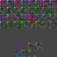

# what

An app to convert any file into a JPEG image and back. Image might look somewhat like this:

It is fairly resistant to re-encoding given that original dimensions are preserved.

All operations are done on the client-side in the browser.

# where

The app is deployed to GitHub pages here: 
[https://ivanlukomskiy.github.io/jpeg_pack/](https://ivanlukomskiy.github.io/jpeg_pack/)

Being a progressive web app, it can be downloaded for offline use.

# why

To send arbitrary files via image-only channels.

# how

The app encodes data to an image in 8x8 chunks for each color channel independently.

YCrCb color space is used because it is what JPEG uses internally.
Each 8x8 chunk for luma occupies 8x8 pixels while chroma occupies 16x16 (taking into account 4:2:0 subsampling).

Binary data is embedded into DCT coefficients of each block. Position of coefficients and target quantization for each 
of them were picked during benchmarking to contain as much data as possible while retaining < 0.1 % errors.

When decoding, inverse DCT transform is performed on each block and binary data is extracted back.

To deal with inevitable errors, Reed-Solomon codes are used which work very well for small amounts. 

# limitations

- Only 0.95-1 JPEG quality supported for now. There's a trade-off between capacity and resistance to low quality and
I targeted only high quality as it fits my use-case best
- Only 4:2:0 subsampling for now (which is default in most cases)
